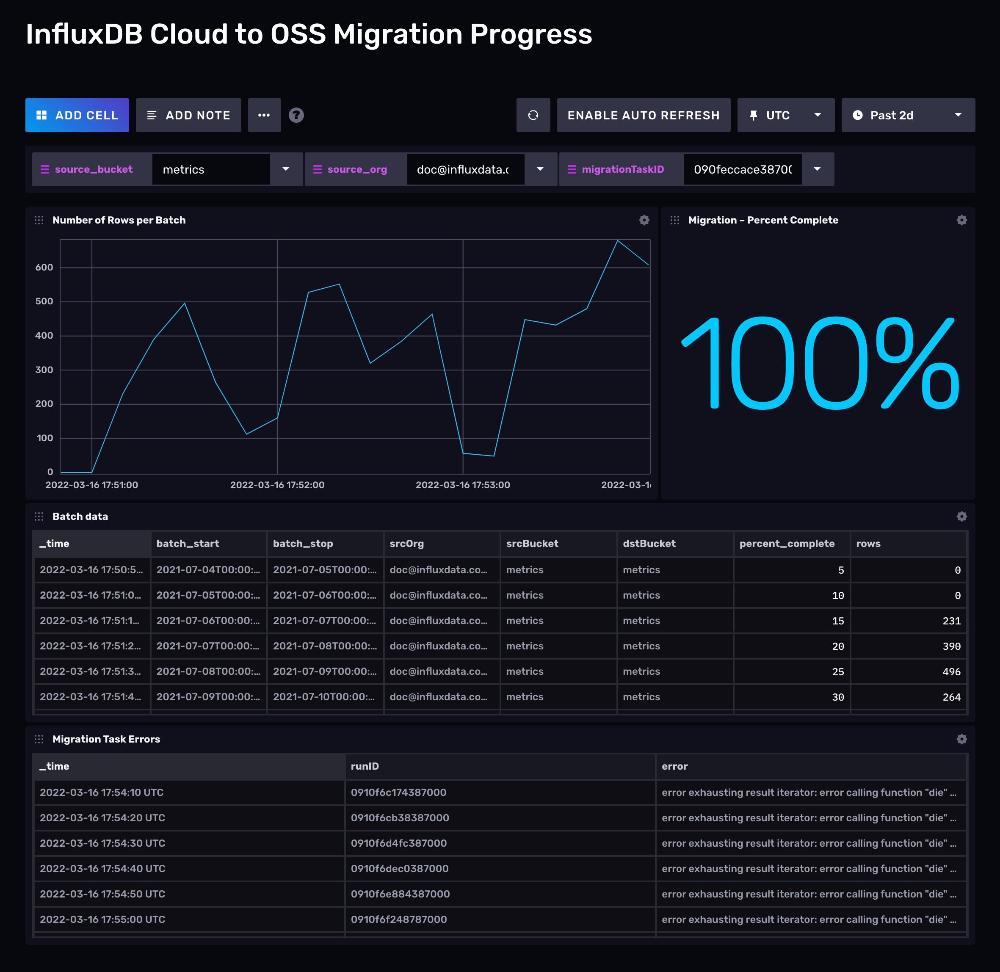

## InfluxDB Cloud to OSS Migration Template

Provided by: [Scott Anderson](https://github.com/sanderson/)

Use this InfluxDB Cloud to OSS Migration template to run and monitor data
migrations from [InfluxDB Cloud]() to [InfluxDB OSS]().



**Imporant:** Install this template on the **InfluxDB OSS** instance you would
like to migrate data to.

## Quick Install

### InfluxDB UI

In the InfluxDB UI, go to **Settings > Templates** and enter the following URL:

```sh
https://raw.githubusercontent.com/influxdata/community-templates/master/influxdb-cloud-oss-migration/migration.yml
```

### Influx CLI

If you have your InfluxDB credentials [configured in the CLI](https://docs.influxdata.com/influxdb/latest/reference/cli/influx/config/), install this template with:

```sh
influx apply -u https://raw.githubusercontent.com/influxdata/community-templates/master/influxdb-cloud-oss-migration/migration.yml
```

## Included Resources

- 1 Bucket: `migration`
- 1 Dashboard: `InfluxDB Cloud to OSS Migration Progress`
- 3 Dashboard Variables:
  - `source_org`
  - `source_bucket`
  - `migrationTaskID`
- 1 Task: `Migrate data from InfluxDB Cloud`
- 1 Label: `Clout to OSS migration`

## Setup Instructions

General instructions on using InfluxDB Templates can be found in [Use a template](../docs/use_a_template.md).

### Set up the migration

1.  **In InfluxDB Cloud**, [create an API token](https://docs.influxdata.com/influxdb/cloud/security/tokens/create-token/)
        with **read access** to the bucket you want to migrate.

2.  **In InfluxDB OSS**:
    1.  Add your **InfluxDB Cloud API token** as a secret using the key,
        `INFLUXDB_CLOUD_TOKEN`.
        _See [Add secrets](https://docs.influxdata.com/influxdb/latest/security/secrets/add/) for more information._
    2.  [Create a bucket](https://docs.influxdata.com/influxdb/latest/organizations/buckets/create-bucket/)
        **to migrate data to**.
    3.  [Create a bucket](https://docs.influxdata.com/influxdb/latest/organizations/buckets/create-bucket/)
        **to store temporary migration metadata**.
    4.  Edit the **Migrate data from InfluxDB Cloud** task installed with this
        template and update the `migration` record properties to suit your migration:

        **migration**:        
        - **start**: Earliest time to include in the migration.
          _See [Determine your migration start time](https://docs.influxdata.com/influxdb/latest/write-data/migrate-cloud-to-oss/#determine-your-migration-start-time)._
        - **stop**: Latest time to include in the migration.
        - **batchInterval**: Duration of each time-based batch.
          _See [Determine your batch interval](https://docs.influxdata.com/influxdb/latest/write-data/migrate-cloud-to-oss/#determine-your-batch-interval)._
        - **batchBucket**: InfluxDB OSS bucket to store migration batch metadata in.
        - **cloudHost**: [InfluxDB Cloud region URL](https://docs.influxdata.com/influxdb/cloud/reference/regions)
          to migrate data from.
        - **cloudOrg**: InfluxDB Cloud organization to migrated data from.
        - **cloudToken**: InfluxDB Cloud API token. To keep the API token secure, store
          it as a secret in InfluxDB OSS.
        - **cloudBucket**: InfluxDB Cloud bucket to migrate data from.
        - **ossBucket**: InfluxDB OSS bucket to migrate data to.
    
    5. Save and enable the task to begin the migration.

**After a migration is complete**, all subsequent executions of the migration
task fail and return the following error:

```
error exhausting result iterator: error calling function "die" @41:9-41:86:
Batch range is beyond the migration range. Migration is complete.
```

For detailed information about this data migration process, see
[Migrate data from InfluxDB Cloud to InfluxDB OSS](https://docs.influxdata.com/influxdb/latest/write-data/migrate-cloud-to-oss/).

## Contact

- Author: Scott Anderson
- Email: scott@influxdata.com
- Github: [@sanderson](https://github.com/sanderson)
- Influx Slack: [@Scott](https://influxdata.com/slack)
